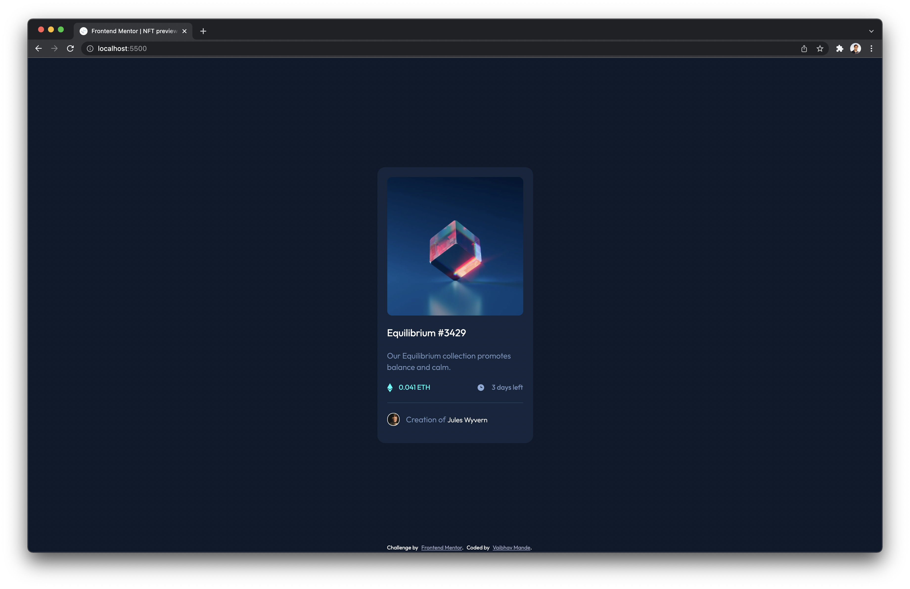

# Frontend Mentor - NFT preview card component solution

This is a solution to the [NFT preview card component challenge on Frontend Mentor](https://www.frontendmentor.io/challenges/nft-preview-card-component-SbdUL_w0U).

## Table of contents

- [Overview](#overview)
  - [The challenge](#the-challenge)
  - [Screenshot](#screenshot)
  - [Links](#links)
- [My process](#my-process)
  - [Built with](#built-with)
  - [What I learned](#what-i-learned)
  - [Useful resources](#useful-resources)
- [Author](#author)

**Note: Delete this note and update the table of contents based on what sections you keep.**

## Overview

This challenge is about creating a card which displays important information about the NFT. It has a mobile as well as Desktop design. The design is provided as images and other information like fonts, icons are provided in the style-guide.md file.

### The challenge

Users should be able to:

- View the optimal layout depending on their device's screen size
- See hover states for interactive elements
- The design should be according to the one provided in the image

### Screenshot



### Links

- Solution URL: [Add solution URL here](https://github.com/vaibhavmande/nft-preview-card-component)
- Live Site URL: [Add live site URL here](https://vaibhavmande.com/nft-preview-card-component)

## My process

### Built with

- SCSS and node-sass to compile to css
- Modern CSS properties
- SCSS mixins [@mixin and @include](https://sass-lang.com/documentation/at-rules/mixin#optional-arguments)
- Flexbox
  - The body is a flex container where the card resides in the center
  - Card is also a flex container rendering all children in columns
- Accessibility issues tested with [Axe developer tools](https://www.deque.com/axe/)
- Separated reset.css and main.css

### What I learned

Using this task, I refreshed my sass workflow and knowledge.
I learnt some DRY techniques to use with scss, `@mixin` as well as `@extend`

For example this adds a hover state style which is common across the application

- Adds hover color and
- Adds cursor pointer to the parent

```scss
@mixin hover-color($color) {
  &:hover {
    cursor: pointer;
    color: $color;
  }
}
```

Few of the mordern CSS properties being used

- `gap`, this can easily add gap between flex children instead of playing with margins amongst children
- `aspect-ratio` to keep the image as square
- `margin-inline` to start and end margin to element instead of adding separately

Use this section to recap over some of your major learnings while working through this project. Writing these out and providing code samples of areas you want to highlight is a great way to reinforce your own knowledge.

### Useful resources

- [Settings up SASS](https://dev.to/chrissiemhrk/how-to-setup-sass-in-your-project-2bo1) - This helped me refersh with using the node-sass in the project and establishing a workflow
- [Keeping SCSS DRY](https://medium.com/backticks-tildes/keeping-your-scss-dry-5211a99be15c) - During the project, there were places where I was finding myself repeating same styles. This article helped me understand different techniques so that I dont have to repeat same stuff.

## Author

- Website - [Vaibhav Mande](https://vaibhavmande.com)
- Frontend Mentor - [@vaibhavmande](https://www.frontendmentor.io/profile/vaibhavmande)
- LinkedIn - [Vaibhav Mande](https://www.linkedin.com/in/vaibhavmande/)
